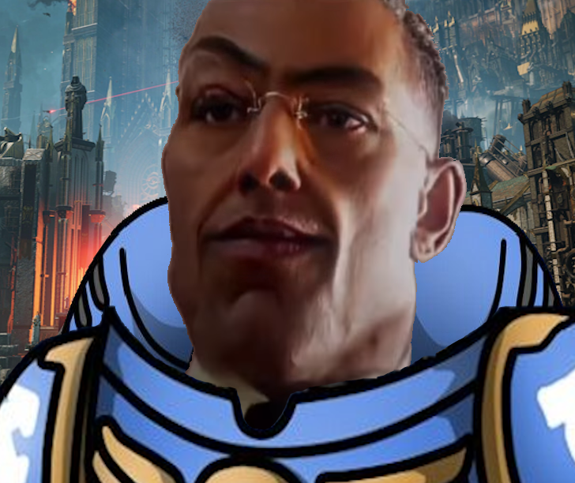

  

# Gladius Reborn

Добро пожаловать в репозиторий мода **Gladius Reborn**!

Это фанатский проект, созданный с любовью к оригинальной игре и желанием сделать её лучше.  
Мы рады любой помощи, и для всех в нашем коммьюнити найдётся занятие по душе.  

✨ Приглашаем мододелов, тестировщиков и гейм-дизайнеров принять участие в развитии проекта,  
который сделает нашу игру чуточку лучше *❤️*

---

## 📌 Основные роли в проекте

В нашей команде существует четыре направления:

- **Разработка** — создание функционала, правки, реализация идей.
- **Аналитика** — проработка концепций, документация, баланс.
- **Тестирование (QA)** — проверка PR, поиск багов, освобождение разработчиков от рутины.
- **Администраторы** — настройка процессов, прав и структуры проекта.

---

## 🔄 Рабочий процесс и правила репозитория

Чтобы обеспечить стабильность и порядок, в проекте используется строгая схема работы с ветками и PR.

### 🧩 Основные ветки

- **`master`** — стабильная ветка, только проверенный и готовый к релизу код.
- **`develop`** — основная ветка разработки, куда вливаются проверенные PR.

Обе ветки защищены.

---

### 🌿 Работа с feature-ветками

1. Каждый разработчик создаёт свою ветку: feature/<название-функции> или fix/<название-бага>
2. Ветки можно пушить свободно (если у вас есть роль разработчика).
3. После завершения работы открывается Pull Request в `develop`.

---

### 🛡 Защищённые ветки

Для веток **`develop`** и **`master`** действует правило:

- **Никаких прямых коммитов или пушей. Только через Pull Request.**
- Для merge требуется **апрув от тестировщика (QA)** или **администратора проекта**.
- Автоматически назначаются ревьюеры по правилам в `CODEOWNERS`.

---

### ✔ Что даёт Review

- Проверку качества кода  
- Защиту от багов  
- Контроль за соответствием концепции проекта  

Каждый PR — это вклад в общий результат.

